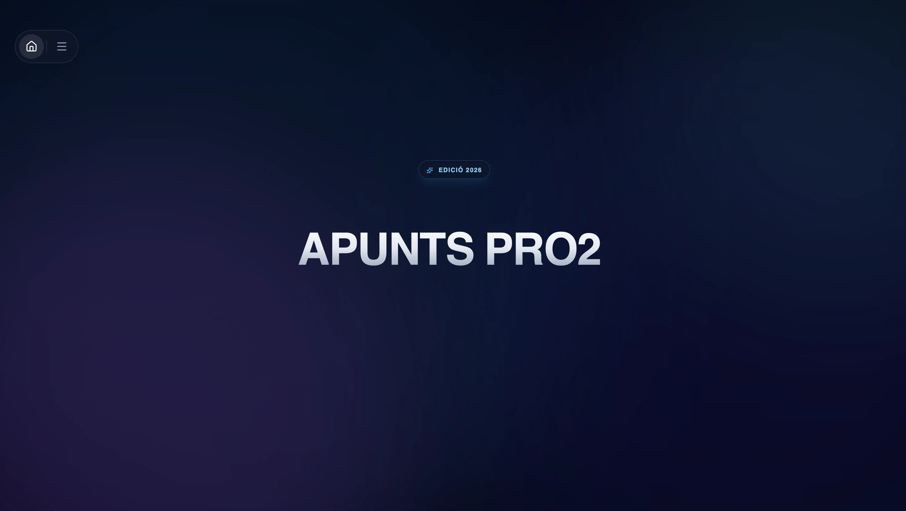

# Apunts

An interactive computing and academic platform engineered for computer science and applied mathematics at UPC-FIB. Built for responsiveness, algorithmic rigor, and real-time collaboration.

<p align="center">
  
</p>

---

## Architectural Highlights

- **Deterministic DAG Engine (`Roadmap`)**  
  Topological curriculum navigation governed by an acyclic graph invariant. Cycle detection runs in $\mathcal{O}(V + E)$ time via zero-allocation queue traversals, cascading prerequisite states deterministically across academic terms.

- **Greedy Interval Partitioning (`Gantt`)**  
  Sub-millisecond timeline layout powered by a binary Min-Heap priority queue. Guarantees $\mathcal{O}(N \log K)$ track scheduling and continuous 60/120 FPS rendering without layout thrashing.

- **Reactive AST Pipeline (`Markdown`)**  
  Nine-pass unified syntax compilation with lazy visualizer isolation. Directives, KaTeX mathematical typesetting, and WebGL contexts execute under isolated error boundaries with zero runtime jank.

- **Realtime Collaborative Canvas**  
  Multiplayer vector drawing and presence tracking backed by Firebase Realtime Database. Cursors are throttled at 20 FPS with `requestAnimationFrame` batching to ensure fluid co-presence with minimal network overhead.

- **Disjoint-Set Comment Architecture**  
  One-level threaded tree reconstruction operating in $\mathcal{O}(N)$ amortized time with true path compression and cycle-guarded root discovery.

---

## System Overview

| Layer | Technologies |
| :--- | :--- |
| **Interface** | React 19, TypeScript, Tailwind CSS v4, Framer Motion |
| **Graphics & Math** | Three.js, React Three Fiber, Mafs, KaTeX, React Force Graph (D3) |
| **State & Flow** | React Flow (`@xyflow/react`), Zustand (`useShallow`), Native Context |
| **Content Pipeline** | `@content-collections` (Zod), Remark / Rehype, CodeMirror |
| **Realtime & Cloud** | Firebase (Auth, Firestore, RTDB), Cloudflare R2, Vercel Serverless |

---

## Getting Started

### Prerequisites

- Node.js 20+
- npm 10+

### Quickstart

```bash
# Clone the repository
git clone https://github.com/CreatorSaWiX/apunts-pro2.git
cd apunts-pro2

# Install dependencies
npm install

# Start development server
npm run dev
```

### Production Build

```bash
# Compile and verify type integrity
npm run build
```

---

## Engineering Standards

- **Strict Type Invariants:** Zero compilation errors under `tsc -b`.
- **Fault Isolation:** Sandboxed error boundaries prevent sub-component failures from bubbling to root views.
- **Allocation Economy:** Cache-first data structures (`Set`, `Map`, Min-Heap) prioritized over repeated array allocations in performance-critical loops.

---

## License

MIT © [CreatorSaWiX](https://github.com/CreatorSaWiX)
